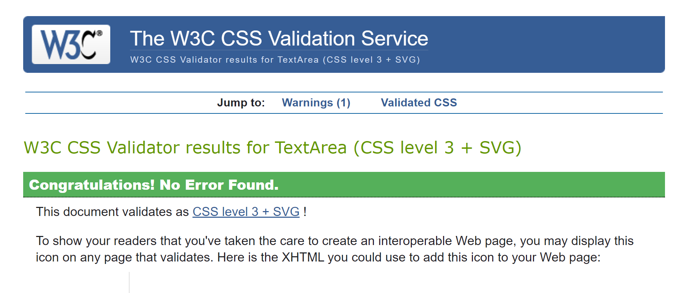
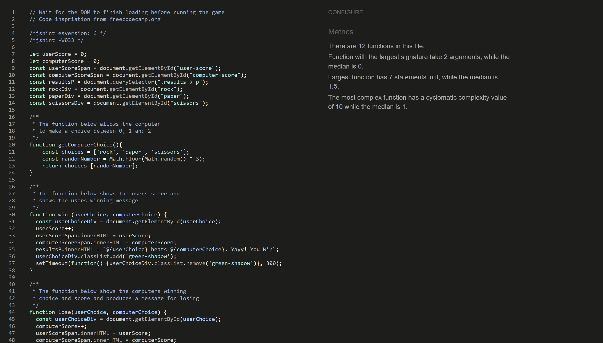

# Rock, Paper, Scissors Game

The Rock, Paper Scissors game has been created for a single user to play against the computer. It has been built using simple JavaScript, HTML and CSS to ensure a clean and fast loading game. Scores are shown for both the user and computer ensuring their is a sense of competetiveness, also engaging the user to continue and remain engaged.

## Responsiveness

The responsiveness has been tested using the site [Am I Responsive](https://ui.dev/amiresponsive) It showed the game works perfectly across all devices.

## Features

Inthis section I shall explain the different features of the game and how it benefits the users.

* #### Game Title

The header part of the game immediatly tells the user what game they are about to play.

* #### Score Area

The score area shows both the user and computers scores. It will change as the game goes on and ensures the user is engaged within the game.

* #### Game Results Area

This section of the game shows what the user chose either rock, paper or scissors and shows the users if they have won, lost or drew, including what the computer chose.

* #### Player Choices Area

The player choices area of the game show three images, fist to show a rock, palm to show paper and a scissor hand image to show scissors. The player can click on either to make a choice. If the users wins then the image will glow green, if the users loses the image will glow red and if the user chooses the same as the computer, then it will glow grey.

## Testing

The code has been tested to show the HTML runs with no errors, that the CSS runs with no errors and that the JavaScript runs with no errors. All areas run well showing no errors as expected.

### Validator Testing

* #### HTML

When the site was run through the [WS3 Validator](https://validator.w3.org/) no errors were shown as shown in the image below.

* #### CSS

The site was run through the [Jigsaw Validator](https://jigsaw.w3.org/css-validator/) and showed no errors as shown in the image below.

* #### JavaScript

The site was run through the [Jshint Validator](https://jshint.com/) and returned no errors with the following metrics
* There are 12 functions in this file.
* Function with the largest signature take 2 arguments, while the median is 0.
* Largest function has 7 statements in it, while the median is 1.5.
* The most complex function has a cyclomatic complexity value of 10 while the median is 1.

* #### Lighthouse Test

The site was tested for performance, best practices and accessibility using Google Lighthouse. All reports game back excellent as shown in the image below.

## Deployment

The site was deployed to GitHub pages. The steps are as follows:
* In the GitHub repository, navigate to the Settings tab
* From the source section drop-down menu, select the Master Branch
* Once the master branch has been selected, the page will be automatically refreshed with a detailed ribbon display to indicate the successful deployment.

The live link can be found here - https://richardg88.github.io/project-2/

## Credits

The inspiration for the game, code, images and fonts were from the following:

### Code 
* Inspiration for the game and code used in this game was used from [Free Code Camp](https://www.freecodecamp.org/)

### Media
* Images used in this game were created using [Canva](https://www.canva.com/)

### Content
* Font used in the game creation was created using [Google Fonts](https://fonts.google.com/)

## Bugs
During the JavaScript validation, i found several semicolon errors showing. This was rectified buy adding the comments  
/*jshint esversion: 6 */ /*jshint -W033 */ to the begining of the JavaScript file.
